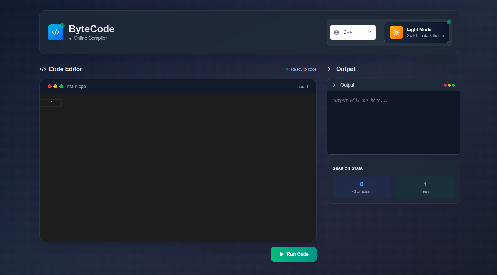

# ⚙️ ByteCode — Online Code Compiler

**ByteCode** is a full-stack web-based compiler that supports execution of Python, C++, and Java code in a secure, isolated Docker environment. Users can write code in the browser, choose a language, and instantly view output — all in real time.


---

## 🛠️ Features

- ✨ Beautiful code editor (Monaco)
- 🌙 Light/dark mode with custom toggle
- ⚡ Real-time code execution
- 🧠 Supports **Python**, **C++**, and **Java**
- 🐳 Docker-based secure runtime isolation
- 🔥 Responsive, modern UI (Tailwind + Next.js)

---

## 📦 Tech Stack

| Frontend         | Backend            | Execution |
|------------------|--------------------|-----------|
| Next.js + Tailwind CSS | Node.js + Express     | Docker     |
| Monaco Editor    | CORS, REST API      | Custom Docker images |

---

## 💻 Supported Languages

| Language | Filename  | Docker Image Used     |
|---------|-----------|------------------------|
| Python  | `main.py` | `python:3.11` or `bytecode-python` |
| C++     | `main.cpp`| `gcc:latest` or `bytecode-cpp`    |
| Java    | `Main.java` | `openjdk:latest` or `bytecode-java` |

---

## 🧪 Local Development

### 1. Clone the repo

```bash
git clone https://github.com/KoderKalash/byteCode.git
cd byteCode
