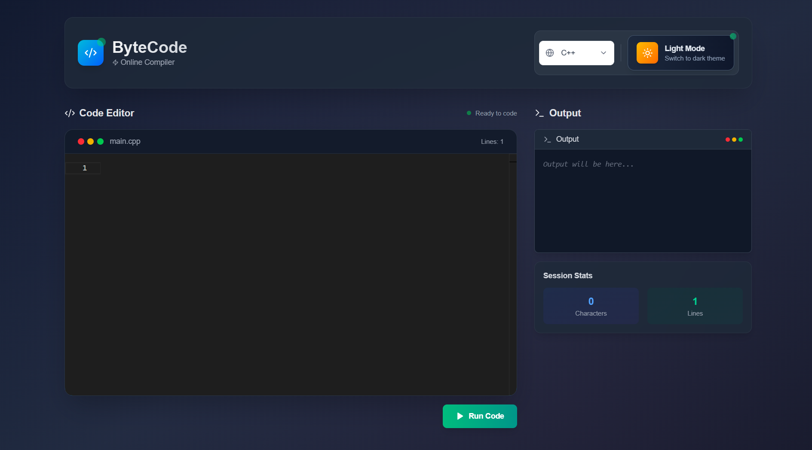

# ⚙️ ByteCode — Online Code Compiler

**ByteCode** is a full-stack web-based compiler that runs Python, C++, and Java
in an isolated, resource-limited Docker sandbox. Write code in the browser, pick
a language, and see the output — including real compiler diagnostics when it
doesn't build.



---

## 🛠️ Features

- ✨ Monaco code editor, self-hosted and following the light/dark toggle
- 🖥️ Output panel that distinguishes success, compile errors, runtime errors,
  timeouts and throttling — each with exit code and run duration
- 🧠 **Python**, **C++**, and **Java**
- ⌨️ **stdin support** — feed input to your program
- 🐳 One throwaway container per submission — no shared state between users
- 🧾 Real compiler and runtime errors, not a generic "failed" message
- ⏱️ Wall-clock timeouts, memory/CPU/PID caps, and no network inside the sandbox
- 🚦 Per-IP rate limiting and a global concurrency cap
- 🔗 Shareable snippet links — code, language and stdin in one URL
- 🔥 Responsive UI (Tailwind + Next.js)

---

## 📦 Tech Stack

| Frontend | Backend | Execution |
|---|---|---|
| Next.js 15 + Tailwind CSS 4 | Node.js + Express 5 | Docker |
| Monaco Editor | REST API, CORS | Per-language sandbox images |

---

## 💻 Supported Languages

| Language | Filename | Image | Toolchain |
|---|---|---|---|
| Python | `main.py` | `bytecode-python` | `python:3.11-slim` |
| C++ | `main.cpp` | `bytecode-cpp` | `gcc:13` (`-std=c++17`) |
| Java | `Main.java` | `bytecode-java` | `eclipse-temurin:21-jdk` |

Images are pinned on purpose — `latest` would change the language version under
your users without warning.

---

## 🔗 Sharing a snippet

Press **Share**. The link lands on your clipboard and the address bar becomes:

```
https://your-bytecode-host/?s=q3TXAAjWvfMd
```

Opening it restores **three** things, not one — the code, the **language**, and
the **stdin**. That last one is the whole point: a program that reads input is
useless to whoever you sent it to if the input didn't travel with the link.

The id is written into the URL with `history.replaceState` rather than a
navigation, so reload and the back button keep working, and the address bar *is*
the link even if the browser refuses the clipboard write.

A few things worth knowing before you paste one into a group chat:

| | |
|---|---|
| **Unlisted, not private** | Anyone holding the link can read the snippet. Ids are unguessable, but that is not access control — don't share secrets this way |
| **They expire** | After `SNIPPET_TTL_DAYS` (90 by default). A dead link shows a dismissible notice and leaves the editor usable, rather than silently doing nothing |
| **Read-only for the recipient** | Opening a link loads the code into *their* editor. Their edits don't touch your snippet; sharing back means pressing Share again |
| **Creating is throttled, opening is not** | 30 new snippets per hour per IP, but reads are deliberately unlimited — rate-limiting those would break the one thing a share link is for |

Set `SNIPPETS_ENABLED=false` to turn the feature off: the two endpoints stop
being served, no database is created, and `GET /health` reports
`"snippets": false`. Note that the frontend does not currently read that flag —
the Share button stays on screen and reports an error if pressed, so a
deployment that disables sharing should hide it in the UI too.

---

## 🔒 How the sandbox works

Each `POST /run-code` gets its own throwaway directory under the system temp dir.
The submission is written there, that directory alone is bind-mounted into the
container at `/sandbox`, and it is deleted when the request finishes. The backend
source tree is never mounted, and two concurrent requests can never see each
other's code.

Every container is started with:

| Flag | Why |
|---|---|
| `--network none` | No outbound traffic; the sandbox can't be used as a proxy |
| `--memory` / `--memory-swap` | An allocation loop can't starve the host |
| `--cpus` | A busy loop can't monopolise the CPU |
| `--pids-limit` | Blocks fork bombs |
| `--read-only` + `--tmpfs /tmp` | Immutable rootfs; only `/sandbox` and a small `/tmp` are writable |
| `--cap-drop ALL`, `--security-opt no-new-privileges` | No privilege escalation |
| `--user 65534:65534` | The program does not run as root |
| `--rm` | Nothing is left behind |

Compiled languages run as two container invocations (compile, then execute) so a
compile error is reported as a compile error with the compiler's own output.

On timeout the container is stopped by name with `docker kill` — killing the
Docker CLI alone would leave it running.

---

## 🚦 Throttling

Two separate limits, because they protect against different things.

**Per-IP rate limit** (`RATE_LIMIT_MAX` per `RATE_LIMIT_WINDOW_MS`) bounds how
*often* one client may ask. Exceeding it returns `429` with `RateLimit` and
`Retry-After` headers so a client can back off without guessing.

**Concurrency cap** (`MAX_CONCURRENT_EXECUTIONS`) bounds how many containers run
*at once*. This is the one that actually caps resource use: a 30-per-minute rate
limit still permits 30 simultaneous runs, which at the default `SANDBOX_MEMORY`
and `SANDBOX_CPUS` would reserve 7.5 GB and 15 CPUs from a single compliant
client. Requests past the cap wait in a short queue
(`MAX_QUEUED_EXECUTIONS`, `QUEUE_TIMEOUT_MS`); past that they get `503` with
`Retry-After` immediately, rather than piling up behind a queue that cannot
drain in time.

`GET /health` reports live gate state (`active`, `queued`, `max`) and is
deliberately **not** rate limited, so monitoring never trips the limiter.

### Behind a proxy

`req.ip` is the proxy's address unless Express is told how many hops to trust,
which would put every client in one rate-limit bucket. Set `TRUST_PROXY_HOPS` to
the number of proxies in front of the app.

Do **not** set it to `true`: a client could then spoof `X-Forwarded-For` and mint
a fresh bucket per request, which is worse than no limit at all. Only an
explicit hop count is honoured.

---

## 🧪 Local Development

You need **Node.js 22 or newer** and a running **Docker** daemon.

Node 20 reached end-of-life on 2026-03-24, so it is not supported. CI runs the
backend suite on both 22 and 24 (Active LTS).

### 1. Clone

```bash
git clone https://github.com/CoderKundu/byteCode-v1.0.0.git
cd byteCode-v1.0.0
```

### 2. Build the sandbox images (once)

```bash
cd backend
npm install
npm run build:images
```

### 3. Start the API

```bash
cp .env.example .env   # optional; sensible defaults are built in
npm start              # http://localhost:5000
```

### 4. Start the frontend

```bash
cd ../frontend
npm install
cp .env.example .env.local
npm run dev            # http://localhost:3000
```

`npm install` is required before `dev` or `build`: the `predev`/`prebuild`
hooks copy Monaco out of `node_modules` into `public/monaco` (~14 MB, gitignored)
so the editor is served by this app rather than by a CDN. The app therefore
makes **no third-party requests at runtime** — the fonts are self-hosted by
`next/font` at build time too.

If Monaco still fails to load, the editor degrades to a plain textarea rather
than a permanent "Loading…", so the page stays usable.

---

## ⚙️ Configuration

Backend (`backend/.env`, see `.env.example`):

| Variable | Default | Purpose |
|---|---|---|
| `PORT` | `5000` | API port |
| `CORS_ORIGINS` | `*` | Comma-separated allowed origins — set this in production |
| `RUN_TIMEOUT_MS` | `10000` | Execution wall-clock budget |
| `COMPILE_TIMEOUT_MS` | `15000` | Compilation wall-clock budget |
| `SANDBOX_MEMORY` | `256m` | Per-container memory cap |
| `SANDBOX_CPUS` | `0.5` | Per-container CPU cap |
| `SANDBOX_PIDS_LIMIT` | `128` | Per-container process cap |
| `MAX_CODE_LENGTH` | `65536` | Largest accepted submission, in characters |
| `MAX_STDIN_LENGTH` | `65536` | Largest accepted stdin payload, in characters |
| `MAX_OUTPUT_BYTES` | `65536` | Output is truncated past this |
| `RATE_LIMIT_WINDOW_MS` | `60000` | Rate-limit window |
| `RATE_LIMIT_MAX` | `30` | Requests per window, per IP |
| `TRUST_PROXY_HOPS` | `0` | Proxies in front of the app (never `true`) |
| `MAX_CONCURRENT_EXECUTIONS` | `4` | Containers running at once |
| `MAX_QUEUED_EXECUTIONS` | `8` | Requests allowed to wait for a slot |
| `QUEUE_TIMEOUT_MS` | `15000` | How long a queued request waits before `503` |
| `SNIPPETS_ENABLED` | `true` | `false` turns sharing off; no database is created |
| `SNIPPET_DB_PATH` | `backend/data/snippets.db` | SQLite file; must be writable in production |
| `SNIPPET_TTL_DAYS` | `90` | How long a share link lives |
| `SNIPPET_RATE_LIMIT_MAX` | `30` | Snippets created per window, per IP |
| `SNIPPET_RATE_LIMIT_WINDOW_MS` | `3600000` | That window (1 hour) |

Frontend (`frontend/.env.local`):

| Variable | Default | Purpose |
|---|---|---|
| `NEXT_PUBLIC_API_URL` | `http://localhost:5000` | Base URL of the API |

---

## 🔌 API

### `POST /run-code`

```json
{ "language": "python", "code": "print(input())", "stdin": "hi\n" }
```

`stdin` is optional. When it is absent or empty the container's stdin is closed,
so a program that reads input gets EOF immediately rather than blocking until
the timeout. It is delivered to the run phase only — a compiler has no use for it.

```json
{
  "ok": true,
  "output": "hi\n",
  "stdout": "hi\n",
  "stderr": "",
  "exitCode": 0,
  "stage": "run",
  "timedOut": false,
  "truncated": false,
  "durationMs": 812
}
```

A compile error, a runtime error, or a timeout is a **200** with `ok: false` —
they're valid answers to a valid request.

Every response carries a `stage` so a client can render the right state without
pattern-matching on prose: `run`, `compile`, `invalid`, `rate_limited`,
`capacity`, `sandbox` or `server`.

| Status | Meaning |
|---|---|
| `200` | Ran. `ok: false` for a compile error, runtime error or timeout |
| `400` | Payload rejected (bad language, missing or oversized code/stdin) |
| `429` | Per-IP rate limit exceeded |
| `503` | At capacity (`Retry-After: 5`), or the sandbox itself is unavailable |

### `POST /snippets`

Saves the editor contents and returns a short id. The frontend's Share button
puts `/?s=<id>` in the address bar and on the clipboard.

```json
{ "language": "python", "code": "print(input())", "stdin": "42\n" }
```

```json
{ "ok": true, "id": "q3TXAAjWvfMd", "expiresAt": 1781234567890 }
```

### `GET /snippets/:id`

```json
{ "ok": true, "id": "q3TXAAjWvfMd", "language": "python",
  "code": "print(input())", "stdin": "42\n",
  "createdAt": 1773458567890, "expiresAt": 1781234567890 }
```

`404` if the id is unknown **or expired** — the two are deliberately the same
answer, so a 410 cannot be used to confirm that an id was once real.

Snippets are stored in SQLite (node's built-in `node:sqlite`, so no extra
dependency and no separate service). Ids are random, not sequential: they are
the only thing keeping one person's link from being guessed. They expire after
`SNIPPET_TTL_DAYS`, and creating one carries its own rate limit, well below the
run limit — this is storage anonymous clients can write to.

**Links are unlisted, not private:** anyone holding one can read the snippet.

### `GET /health`

```json
{
  "status": "ok",
  "languages": ["python", "cpp", "java"],
  "executions": { "active": 0, "queued": 0, "max": 4 },
  "snippets": true
}
```

---

## ✅ Tests

```bash
cd backend
npm test
```

44 tests, covering execution, throttling, the concurrency gate and snippet storage.

The suite runs without a Docker daemon: it puts a stub `docker` CLI on `PATH`
(`test/fixtures/docker`) and asserts on how the real one *would* be invoked —
the hardening flags, that only the temp dir is mounted, that it's cleaned up,
that concurrent submissions stay isolated, that compiler output is passed
through, that stdin reaches the program but not the compiler, and that a hanging
program is killed and times out promptly.

### End-to-end smoke test

Because the unit suite stubs Docker out, there is a separate smoke test that
runs against a **real** daemon:

```bash
npm run build:images
npm start &
npm run smoke
```

It asserts what the stub cannot: that each toolchain compiles and runs a program
under `--read-only` as an unprivileged uid, that stdin is delivered in all three
languages, that a compile error comes back with the compiler's own diagnostics,
that the sandbox has no network access and cannot write outside its work
directory, and that an infinite loop times out **without leaving a container
running**.

CI (`.github/workflows/ci.yml`) runs all of this on every pull request: the unit
suite, a frontend lint/build, and the smoke test — which builds the images
first, so it also verifies the pinned base tags still exist.

---

## ➕ Adding a language

Drop a spec in `backend/executor/language/`:

```js
module.exports = {
  id: "go",
  label: "Go",
  filename: "main.go",
  image: "bytecode-go",
  compile: null,                  // or an argv array
  run: ["go", "run", "main.go"],
}
```

Register it in `backend/executor/language/index.js`, add a
`backend/docker/Dockerfile.go`, add it to `docker/build.sh` and to
`frontend/constants/languages.js`.

---

## 🚀 Deploying

The frontend goes to Vercel; the backend needs a VPS, because it starts a Docker
container per submission and so needs a Docker socket — which Vercel, Netlify and
most serverless platforms do not provide.

See **[deploy/README.md](deploy/README.md)** for the runbook:
`deploy/setup-vps.sh` provisions the box, `deploy/bytecode-api.service` runs the
API, `deploy/nginx.conf` terminates TLS, and `frontend/vercel.json` configures
the frontend.

Read the security note at the top of that file first: the API's service account
must reach the Docker socket, which is root-equivalent on that host.

---

## 🗺️ Roadmap

- [ ] A warm container pool to cut cold-start latency
